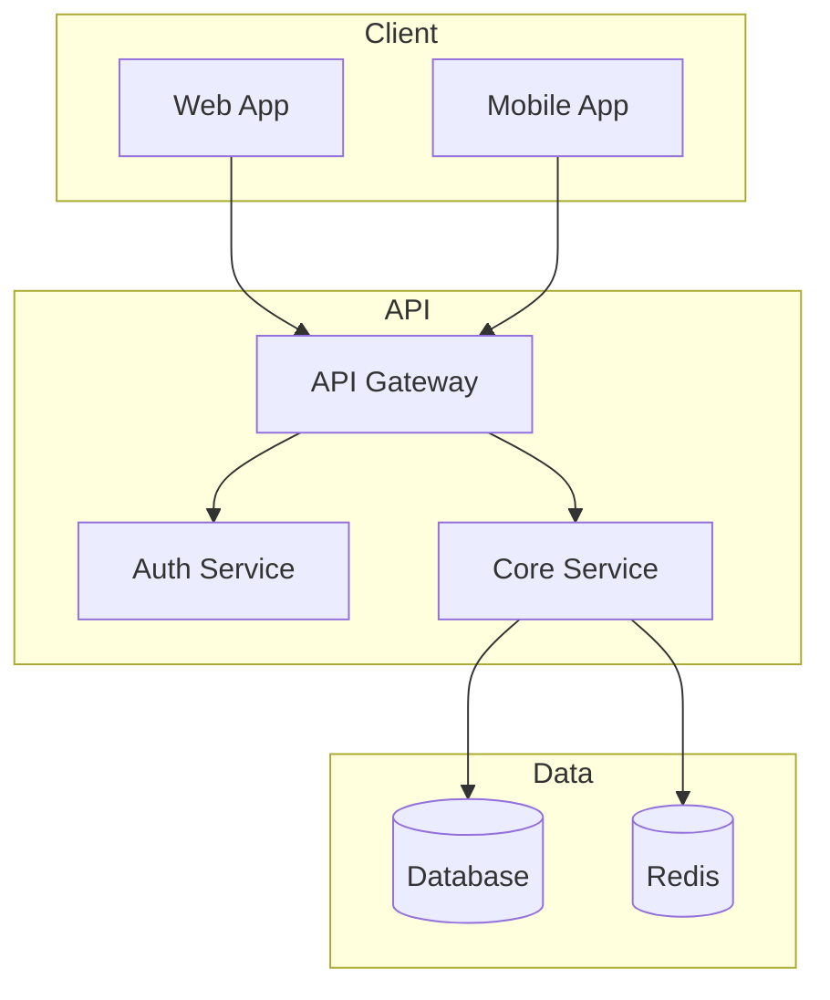
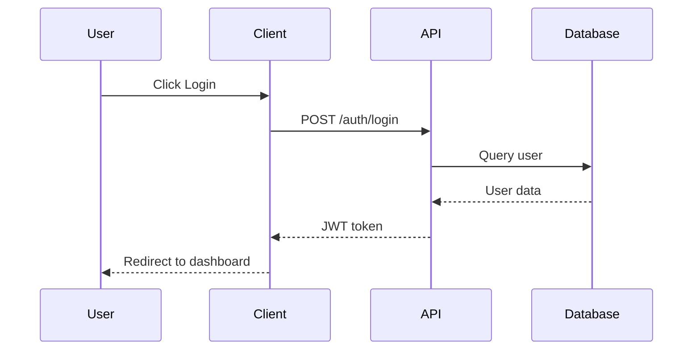
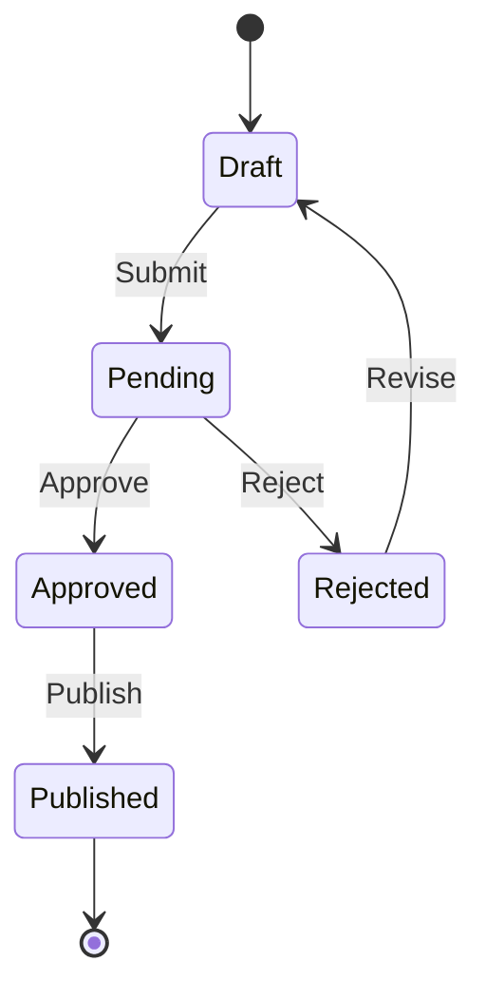
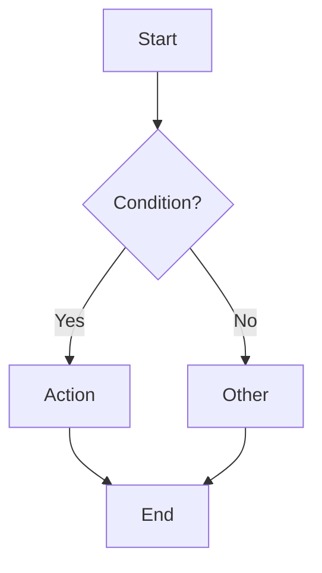
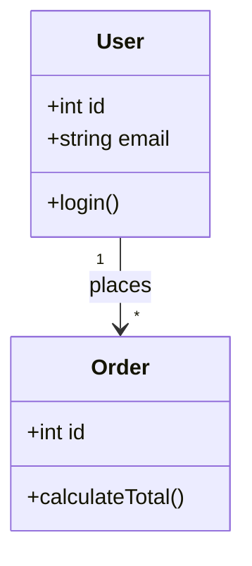

# Mermaid Diagram Templates

Copy-paste templates for common diagram types.

## Architecture



## Sequence



## State Machine



## ERD

```mermaid
erDiagram
    USER ||--o{ ORDER : places
    USER { int id PK; string email; string name }
    ORDER ||--|{ ORDER_ITEM : contains
    ORDER { int id PK; int user_id FK; string status }
    ORDER_ITEM { int id PK; int order_id FK; int quantity }
    PRODUCT ||--o{ ORDER_ITEM : "ordered in"
    PRODUCT { int id PK; string name; decimal price }
```

## Flowchart



## Class


