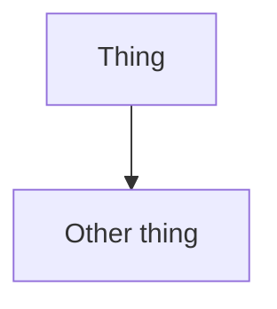

# Diagrams

Keep diagrams small and scoped to a single question. Prefer Mermaid in Markdown so diagrams stay in git and are easy to update.

## Conventions

- One diagram per file: `docs/diagrams/<topic>.md`
- Start with a 1–2 sentence “what this shows” overview.
- Match names in the diagram to names in code.

## Mermaid Template

````markdown
# <Topic>

## Overview
<1–2 sentences>

## Diagram


```
````

## Generating Diagrams

- Use the `.claude/skills/diagram-gen` skill to create/update Mermaid diagrams.
